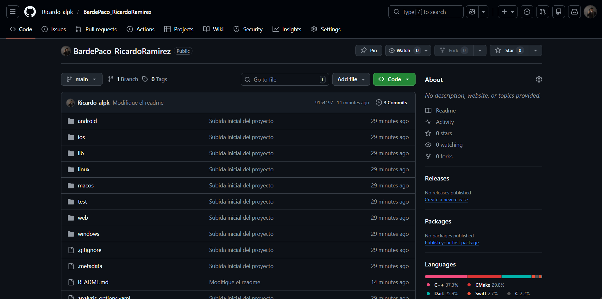
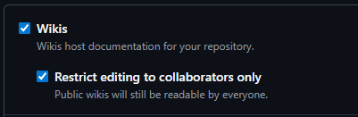
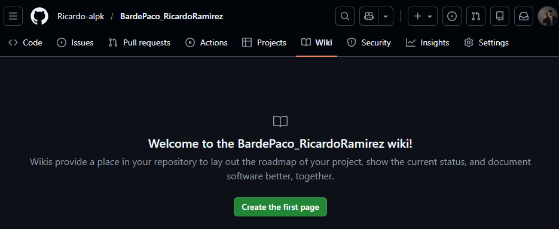

# paco_bar - Ricardo Ramirez
A new Flutter project.

Lo primero que hare sera haber subido el proyecto a github:

Nos aseguramos de activar las wikis:

Y vemos que disponemos ahora del apartado "WIKI" en nuestro proyecto.

